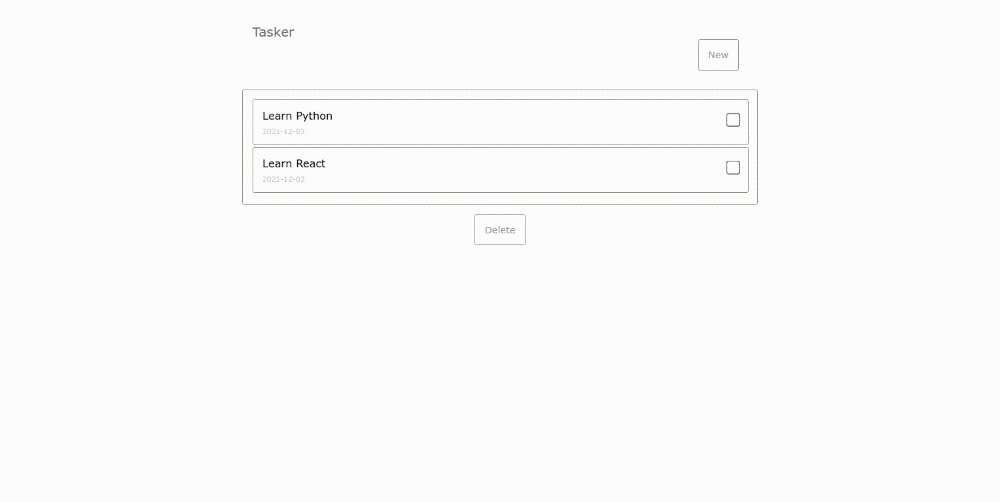
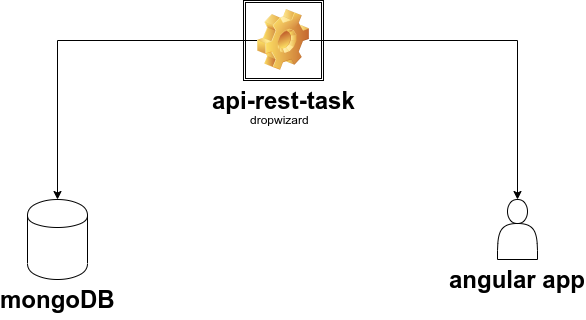

# Task management

- Start application
  `docker-compose up`

- Re build container:
  `docker-compose up --build`

- Visit -> http://localhost:4200

## How to use

- Create a new task -> click on the button "New"
- Update task -> double click over the task and type the new title of the task, after that double click again to finish the update mode.
- Delete task -> select the task/s that you want to remove by clicking on the checkbox after that click on the button "Delete".

# Diagram architecture

## Backend

- Check postman collection to understand the api behaviour:
  `api-rest-task.postman_collection.json`

# Clean docker workspace

- Delete containers
  `docker container prune`
- Delete images
  `docker rmi $(docker images -q)`
